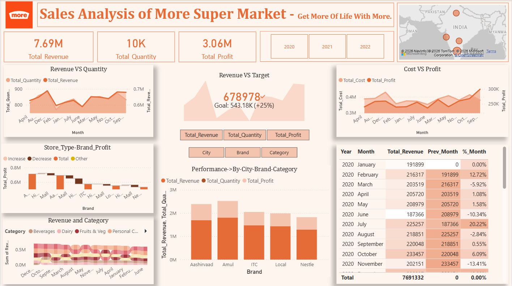

# 📊 More Supermarket Sales Analysis Dashboard (Power BI)

## 📌 Project Overview
Developed an interactive Power BI dashboard to analyze sales performance, profitability, and store-level trends for More Supermarket across major cities in India. The dashboard was designed to support business decision-making using dynamic visuals and secure data access.

---

## 📂 Dataset
- Time Period: 2020–2022
- Locations: Bangalore, Delhi, Hyderabad, Mumbai
- Metrics: Revenue, Profit, Quantity, Cost, Discount
- Analysis Dimensions: Brand, Category, Store, City

---

## ⚙️ Tools & Technologies
- Power BI
- Excel (Data Cleaning & Transformation)

---

## 📊 Dashboard Features
- KPI Cards for Revenue, Profit, and Quantity
- Dynamic Parameters for switching metrics
- Custom Tooltips for store-level discount insights
- Row-Level Security (RLS) for city-wise access control
- Revenue vs Cost Trend Analysis
- Brand & Category Performance Tracking
- Interactive Filters and Slicers

---

## 🔍 Key Business Insights
- Identified top-performing brands contributing to overall revenue
- Analyzed profitability trends across cities and stores
- Highlighted discount-driven sales performance
- Enabled secure role-based reporting for city managers

---

## 📸 Dashboard Preview

---

## 📁 Repository Structure

- dataset/
- dashboard/
- images/

---

## 💡 Key Learnings
- Implemented Row-Level Security (RLS) in Power BI
- Built dynamic parameter-driven visuals
- Enhanced dashboard interactivity using tooltips and slicers
- Improved analytical storytelling through business-focused insights
